<div align="center">


# ⟨ GUSTAVO KELLER FIORINDO ⟩
### `Computer Engineering Student // IT Infrastructure & Cloud`


</div>

<div align="center">
  
</div>

---

## `01 // IDENTITY`

```typescript
const explorer = {
  name: "Gustavo Keller Fiorindo",
  role: "Computer Engineering Student",
  focus: "IT Infrastructure & Cloud Computing",
  stack: ["Linux", "Python", "C", "TCP/IP", "DNS", "DHCP"],
  studying: "Cloud Computing fundamentals",
  building: "First infrastructure project — coming soon",
  interests: ["Cloud", "Data Engineering", "Semiconductor Physics", "Quantum Computing"],
  mindset: "Explore the stack. Understand the system. Deploy to the cloud."
};
```

---

## `02 // TECH_STACK`

**Systems & Networking**


**Programming & Automation**


**Web**


**Cloud/DevOps** *(in progress)*


---

## `03 // TERMINAL`

```bash
> booting explorer system...

[ OK ] Identity module loaded
[ OK ] Systems & networking module loaded
[ OK ] Automation module loaded
[ .. ] Cloud module — syncing

ROLE        : Computer Engineering Student
STACK       : Linux · Python · C · TCP/IP · DNS · DHCP
STUDYING    : Cloud Computing
BUILDING    : Project — not yet initialized
STATUS      : ONLINE

> awaiting next challenge... █
```

---

## `04 // FEATURED_PROJECT`

> 🛰️ **No flagship project deployed yet.**
> This section is reserved for the main mission once it launches — currently in the design phase.

<div align="center">


</div>

---

## `05 // PROJECT_ARCHIVE`

> 📁 No archived projects yet — this section will grow as early studies and experiments are published.

---

## `06 // SYSTEM_METRICS`

<div align="center">


</div>

> ⚠️ These widgets depend on external services (github-readme-stats / streak-stats) and may load slowly or be temporarily unavailable — this is normal and not an error in your setup.

---

## `07 // CONTRIBUTION_MATRIX`

<div align="center">


</div>

> ⚠️ Also relies on an external service and may take a moment to render.

---

## `08 // CONNECT`

<div align="center">

[](https://www.linkedin.com/in/gustavo-keller-fiorindo-01397a356/)
[](https://www.instagram.com/gu_keller/)
[](https://github.com/kellinho11)

</div>

<div align="center">
<sub>Signal transmitted from sector BR // system evolving continuously 🛰️</sub>
</div>
